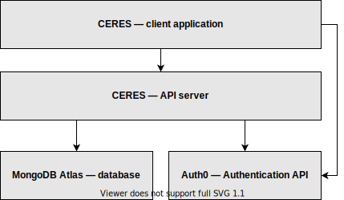

# technical-documentation
Technical documentation for the Ceres app and API server for OMAFRA

This repo includes a number of resources aimed to give an understanding of the `ALPHA prototype` developed during the Code for Canada fellowship program.

The resources included here document the CERES app and the API server that powers the backend of the app and will document the use of other 3rd party services used in the development and deployment of the `ALPHA prototype`

## Application Architecture

The Ceres application consists of 3 simple layers:
* **presentation layer** — a client web application
* **logic & data layer** — a RESTful API
* **data storage/external service layer** — 3rd party APIs (MongoDB Atlas, Auth0, etc.)

[Read more about the application architecture](./app_architecture/architecture.md)

More architecture diagrams:
* [Database model](./app_architecture/database_model)
* [API application architecture](./app_architecture/ceres_api_architecture_diagram.svg)

## API Documentation

The Ceres API currently has three routers:
* **Data Router**
* **User Router**
* **Admin Router**

[Read the detailed API documentation](./api_documentation.md)

## Existing Bugs

After releasing a demo of the Ceres app two bugs were identified by users:
1. [Authentication error that denies access to the API on many ministry devices](./bug_reporting/0_auth_popup_bug/writeup.md)
1. [Dataset downloads cannot be opened directly in Excel](./bug_reporting/1_excel_csv_bug/writeup.md)