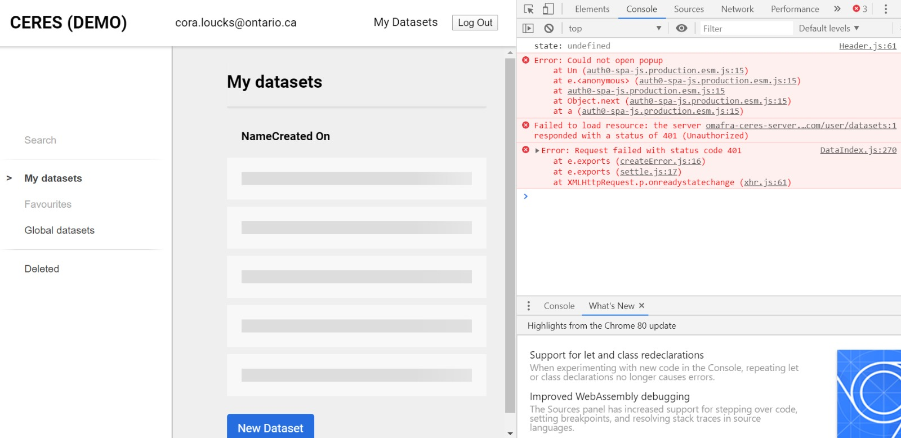
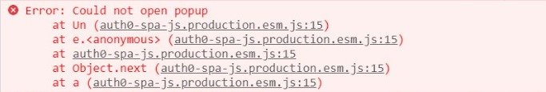
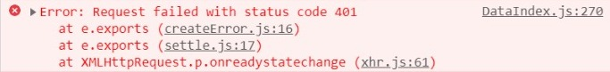

# Authentication Popup Bug Writeup

> Users on some ministry devices (but not all) have reported an inability to create datasets. This has been narrowed down to an error with the authentication system not receiving authorization and therefore users' requests to the Ceres API are been returned with a status of `401 - Unauthorized`

## Steps to reproduce

1. Use a non-ministry computer (or a ministry device without popups blocked)
1. Login or create account
1. Walk through the steps to create a new dataset
1. Click create (and nothing will happen)

## Diagnosis

This error appears before attempting to create a dataset, however this is the step that most users recognize that something is going wrong.

We can actually see the error on the first screen after logging in:

In the above screenshot we can see two separate errors occuring. The ministry device blocking a popup and a `401 - Unauthorized` response.

* The Auth0 authentication relies on a user granting permission to the Auth0 tenant to connect with the external API.
* This permission can only be granted through a popup — limitation of the Auth0 platform, implemented to adhere to security best-practices.
* Many ministry devices block popups and do not allow user override.
* Therefore on many ministry devices the app cannot be authenticated.

## Suggested Resolution

This appears to be a limitation of the Auth0 implementation and there does not seem to be an easy resolution within their system. Therefore the recommendation is to replace the authentication implementation with the development teams preferred solution.

> Recommended authentication library: [Passport.js](http://www.passportjs.org/)

**Authentication considerations**
1. Must allow for roles to be assigned to users
1. Any admin user account must be able to update user roles, status, etc.
1. Must not restrict user emails to `ontario.ca` emails addresses — must allow the signup of external researchers, summer students, etc.